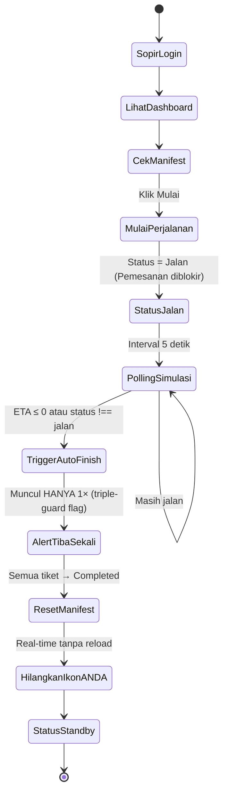
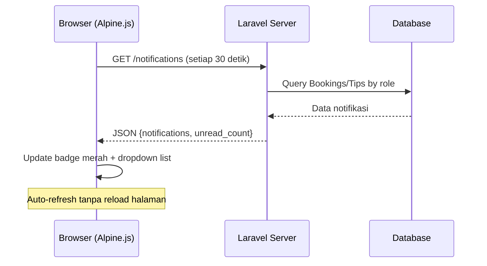
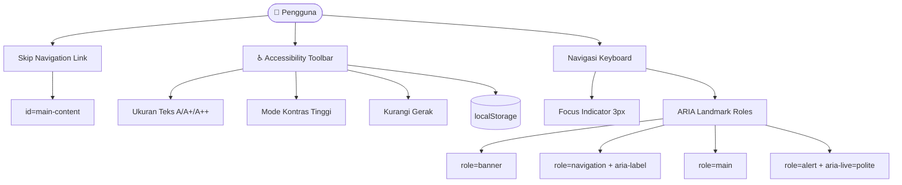
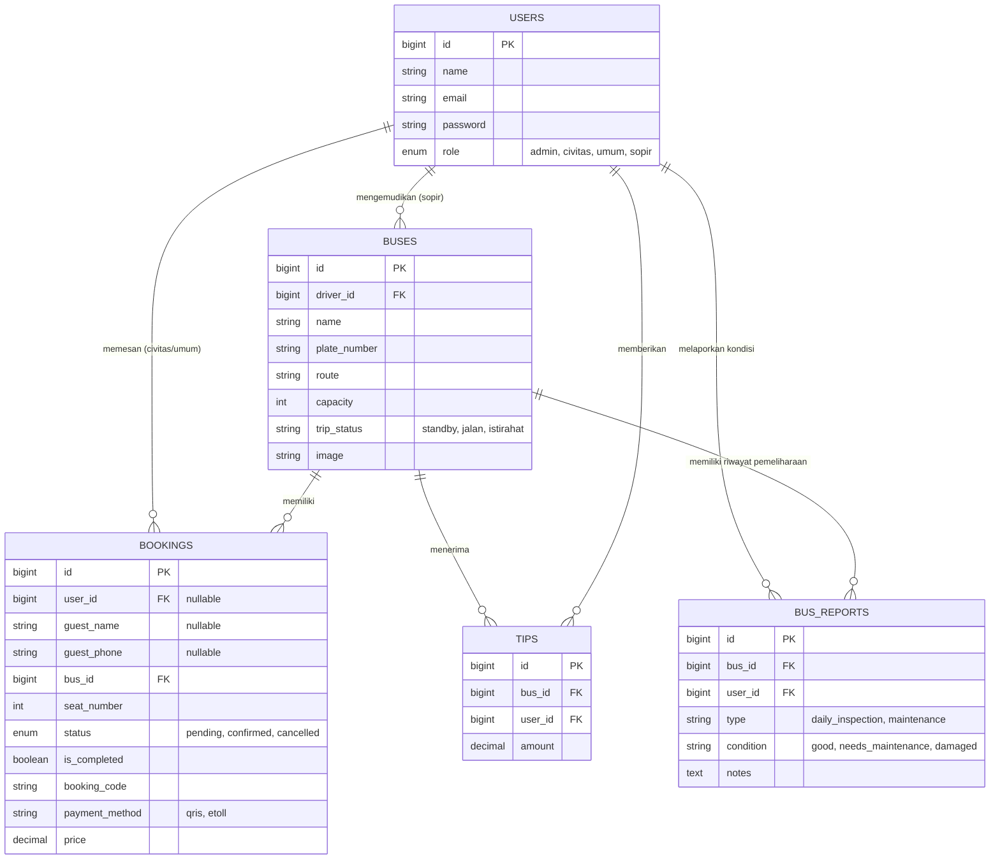

# Laporan Pengembangan Sistem Informasi Tiket Bus Kampus Non-Merdeka

**Mata Kuliah:** Rekayasa Perangkat Lunak Lanjut (Magister Rekayasa Perangkat Lunak)  
**Proyek:** Sistem Informasi Tiket Bus Kampus Kampus Non-Merdeka  
**Pendekatan:** Agile Software Development  
**Versi Sistem:** 3.2 — April 2026  

---

## 1. PENDAHULUAN (Apa dan Mengapa)

### 1.1. Apa itu Sistem Bus Kampus Non-Merdeka?
Sistem Bus Kampus Non-Merdeka adalah platform berbasis web yang melayani pemesanan (ticketing) dan pemantauan operasional bus transit antarkampus Kampus Non-Merdeka. Platform ini dilengkapi dengan identitas visual resmi Kampus Non-Merdeka (logo universitas) di seluruh antarmuka, dan menyediakan antarmuka yang disesuaikan berdasarkan perannya:
- **Tamu/Umum:** Pengguna tanpa akun yang dapat memesan tiket tunggal tanpa login.
- **Civitas Akademika:** Mahasiswa, dosen, dan staf dengan akses penuh — maks 4 kursi per transaksi, tarif khusus E-Tol Rp 3.000.
- **Sopir Bus:** Operator armada yang mengelola manifes penumpang, memperbarui status perjalanan secara *real-time*, dan menerima tip anonim beserta notifikasi masuk.
- **Administrator:** Pengelola sistem yang mengatur data master (bus, sopir, rute), memonitor transaksi, dan mengakses laporan keuangan terpusat dengan visualisasi grafik.

### 1.2. Mengapa Sistem Ini Dibuat?
1. **Ketidakteraturan Antrean & Kapasitas:** Tanpa sistem booking, terjadi penumpukan penumpang di jam sibuk.
2. **Prioritas & Batasan Akses:** Tidak ada mekanisme yang mengutamakan sivitas akademika dan mencegah double-booking.
3. **Visibilitas Operasional:** Penumpang tidak mengetahui posisi atau status bus secara real-time.
4. **Validasi & Laporan Keuangan:** Tidak ada laporan transparan mengenai pendapatan tiket vs. donasi/tip sopir.
5. **Minimnya Komunikasi Digital:** Tidak ada sistem notifikasi yang memberitahu penumpang/admin perubahan status.
6. **Inklusivitas & Aksesibilitas:** Sistem belum mempertimbangkan kebutuhan pengguna difabel atau preferensi visual.

Sistem ini menyelesaikan semua permasalahan di atas melalui digitalisasi alur pemesanan dengan Role-Based Access Control, dual-route queue simulation, proteksi multi-pemesanan, sistem tip berbatas, laporan keuangan terpusat, notifikasi real-time, standar aksesibilitas WCAG 2.1, dan branding identitas visual Kampus Non-Merdeka yang konsisten.

---

## 2. METODOLOGI PENGEMBANGAN (Bagaimana Sistem Dibuat)

Sistem ini dikembangkan menggunakan kerangka kerja **Agile Software Development** (pendekatan Scrum/Kanban). Pendekatan ini dipilih karena kebutuhan yang berkembang dinamis selama fase pengujian.

### 2.1. Siklus Agile yang Diterapkan:
1. **Requirements Session (Backlog Creation):** Pengumpulan User Stories — contoh: *"Sebagai admin, saya ingin melihat notifikasi booking pending secara real-time"*.
2. **Sprint Planning:** Mengambil Product Backlog untuk dieksekusi per iterasi.
3. **Daily Development & Refactoring:** Laravel (PHP), Alpine.js, Tailwind CSS, MySQL, Leaflet.js.
4. **Testing (UAT):** Eksekusi User Acceptance Testing — temuan langsung masuk backlog iterasi berikutnya.
5. **Deployment & Review:** Rilis inkremental via Herd (Laravel Herd) untuk environment lokal.

### 2.2. Sprint Summary — Fitur yang Dikembangkan:

| Sprint | Fitur Utama |
|--------|-------------|
| Sprint 1 | Autentikasi, RBAC 4 peran, CRUD Bus & Sopir |
| Sprint 2 | Sistem Booking Civitas & Umum, validasi waktu operasional |
| Sprint 3 | Booking Tamu tanpa login, pembayaran QRIS & E-Tol simulasi |
| Sprint 4 | Proteksi double-booking global, limitasi kursi per peran |
| Sprint 5 | Peta real-time Leaflet.js, simulasi 13 armada dual-route |
| Sprint 6 | Auto-finish trip, ikon ANDA real-time, tip anonim |
| Sprint 7 | Laporan keuangan admin, grafik tren + ekspor PDF |
| Sprint 8 | Branding logo Kampus Non-Merdeka (seluruh antarmuka + error pages) |
| Sprint 9 | Sistem notifikasi bell (Admin/User/Sopir), z-index fix |
| Sprint 10 | Bug fix: auto-finish alert hanya muncul 1x, ikon Pro FA replacement |
| Sprint 11 | **Aksesibilitas WCAG 2.1 Level AA** — skip nav, ARIA roles, toolbar ♿, kontras, reduced motion |
| Sprint 12 | **Pengujian Error Pages** — route `/test-error/*`, dashboard uji 6 kode error, laporan pengujian PDF |
| Sprint 13 | **Infrastruktur Maintenance & Synchronize** — Laporan Harian Sopir, Rekam Jejak Perawatan Admin, Real-time List Admin, Proteksi Hapus Armada |
| Sprint 14 | **Purwarupa Pemesanan Inklusif** — Single-file UI HTML (Identity Before Inventory), Kursi Prioritas Difabel & Lansia |
| Sprint 15 | **Keamanan Middleware & Notifikasi** — Role Isolation `UserMiddleware` dan Sinkronisasi Notifikasi Otomatis berbasis *LocalStorage* Hybrid |
| Sprint 16 | **Penyempurnaan Simulasi & Backend Logic** — Auto-Cancel 15-Detik Geofencing, Perbaikan ORM `$fillable` Mass Assignment, dan Fitur *Driver Revive/Override* di Dashboard Sopir |

---

## 3. ARSITEKTUR DAN DIAGRAM SISTEM

### 3.1. Use Case Diagram

```mermaid
flowchart TD
    Guest([🚶 Tamu Umum]) --> UC1[Lihat Jadwal & Rute]
    Guest --> UC2[Booking Tiket Tanpa Akun]

    Civitas([🎓 Civitas Akademika]) --> UCL[Login / Autentikasi]
    Civitas --> UC1
    Civitas --> UC3[Booking Tiket Multi-Kursi]
    Civitas --> UC4[Kirim Tip Anonim]
    Civitas --> UC9[Lihat Notifikasi Status Tiket]
    Civitas --> UC13[Gunakan Toolbar Aksesibilitas]

    Driver([🚌 Sopir]) --> UCL
    Driver --> UC5[Lihat Manifes Penumpang]
    Driver --> UC6[Ubah Status Perjalanan]
    Driver --> UC10[Terima Notifikasi Tip]
    Driver --> UC15[Isi Inspeksi Laporan Harian Bus]

    Admin([👑 Administrator]) --> UCL
    Admin --> UC7[Kelola Data Bus & Sopir]
    Admin --> UC8[Approval & Monitor Pemesanan]
    Admin --> UC11[Laporan Keuangan & Grafik]
    Admin --> UC12[Lihat Notifikasi Booking Pending]
    Admin --> UC14[Uji Halaman Error via Dashboard]
    Admin --> UC16[Input Catatan Audit Perawatan Bus]
```



### 3.2. Activity Diagram: Alur Pemesanan

```mermaid
stateDiagram-v2
    [*] --> BukaAplikasi
    BukaAplikasi --> PilihanAkses : Pilih Menu Booking
    
    state PilihanAkses <<choice>>
    PilihanAkses --> LoginMode : Memiliki Akun
    PilihanAkses --> GuestMode : Masuk Tanpa Login

    LoginMode --> ValidasiLogin
    ValidasiLogin --> CekPeran : Sukses

    state CekPeran <<choice>>
    CekPeran --> DashboardCivitas : Role = Civitas (maks 4 kursi)
    CekPeran --> DashboardUmum : Role = Umum (maks 1 kursi)

    GuestMode --> FormGuest : Masukkan Nama & No. HP
    FormGuest --> PilihKursi : Di-lock maks 1 kursi

    DashboardCivitas --> PilihKursi
    DashboardUmum --> PilihKursi

    PilihKursi --> CekDoubleBooking
    state CekDoubleBooking <<choice>>
    CekDoubleBooking --> TolakDouble : Sudah memiliki tiket aktif
    CekDoubleBooking --> CekKetersediaan : Tidak ada tiket aktif

    state CekKetersediaan <<choice>>
    CekKetersediaan --> TolakPenuh : Kursi habis
    CekKetersediaan --> BuatPesanan : Kursi tersedia

    BuatPesanan --> StatusPending --> TampilNotifikasi
    TampilNotifikasi --> [*]
    TolakDouble --> [*]
    TolakPenuh --> [*]
```

### 3.3. Activity Diagram: Alur Operasional Sopir & Auto-Finish



### 3.4. Arsitektur Notifikasi Bell



### 3.5. Arsitektur Aksesibilitas WCAG 2.1 *(BARU — Sprint 11)*



### 3.6. Diagram Konseptual Database (Entity Relationship)



---

## 4. FITUR SISTEM (Versi 3.2)

### 4.1 Branding Kampus Non-Merdeka
- Logo resmi `logo_kampus_non_merdeka.png` diintegrasikan di seluruh antarmuka: Sidebar Admin, Sidebar User, Navbar Sopir, Landing Page (navbar + footer), Peta Real-Time.
- Logo ditampilkan dalam *circle badge* putih elegan yang konsisten di semua layout.

### 4.2 Halaman Error Premium (401, 403, 404, 419, 500, 503)
- Desain glassmorphism dengan latar cross-pattern SVG.
- Logo Kampus Non-Merdeka melayang dengan animasi radar ping.
- Tombol "Kembali Coba" dan "Beranda Utama".
- Skema warna gradien navy-merah Kampus Non-Merdeka.
- **Route uji** `/test-error/{kode}` tersedia di environment lokal (Sprint 12).
- **Dashboard pengujian** di `/test-error/` menampilkan 6 kartu error dan panduan cara menguji.

### 4.3 Sistem Notifikasi Bell Real-Time
- Endpoint `GET /notifications` tersedia untuk semua peran (auth required).
- **Admin:** Booking pending (unread/merah) + booking terkonfirmasi terbaru.
- **User:** Status tiket sendiri (pending/confirmed/cancelled).
- **Sopir:** Tip masuk yang diterima dari penumpang anonim.
- Auto-refresh setiap 30 detik, badge unread merah, dropdown premium dengan animasi.

### 4.4 Proteksi Auto-Finish (Triple Guard)
- `_autoFinishFired` (module-level) + `this.autoFinished` (instance) + cek status.
- Alert "Tiba di Tujuan" **hanya muncul tepat 1 kali** per perjalanan.
- Tidak me-reset flag saat terjadi error — satu percobaan cukup.

### 4.5 Aksesibilitas WCAG 2.1 Level AA *(BARU — Sprint 11)*

Implementasi standar aksesibilitas global mencakup:

| Kriteria | Level | Implementasi |
|---|---|---|
| 1.1.1 Non-text Content | A | `aria-hidden` pada ikon dekoratif, `alt` deskriptif pada semua gambar |
| 1.3.1 Info & Relationships | A | Landmark roles: `banner`, `navigation`, `main`, `complementary` |
| 1.4.3 Contrast Minimum | AA | Semua teks sidebar ≥ 4.5:1 (rgba white/0.85), badge diperbaiki |
| 2.1.1 Keyboard | A | Semua fitur dapat diakses via keyboard |
| 2.3.3 Animation from Interactions | AAA | Toggle kurangi gerak + `prefers-reduced-motion` CSS |
| 2.4.1 Bypass Blocks | A | Skip navigation "Lewati ke konten utama" di semua layout |
| 2.4.7 Focus Visible | AA | Focus indicator 3px `outline: solid #c41e3a` di semua elemen |
| 3.1.1 Language of Page | A | `<html lang>` dinamis sesuai locale aktif |
| 4.1.2 Name, Role, Value | A | `aria-label`, `aria-expanded`, `aria-current`, `aria-controls` |
| 4.1.3 Status Messages | AA | `role="alert"` + `aria-live="polite"` pada flash messages |

**Accessibility Toolbar** (`partials/accessibility-toolbar.blade.php`):
- Toggle ukuran teks: Normal / A+ (110%) / A++ (125%)
- Mode Kontras Tinggi via CSS `filter: contrast(1.5)`
- Mode Kurangi Gerak — menonaktifkan semua animasi
- State tersimpan di `localStorage` — persisten antar sesi
- Tersedia di semua halaman: welcome, admin, user

### 4.6 Infrastruktur Inspeksi Laporan Harian & Audit Maintenance *(BARU — Sprint 13)*
- **Laporan Harian (Sopir):** Form _Laporan Inspeksi Harian_ pasca-shift selesai ada di panel pengguna Sopir. Sopir memilih indikasi fisik Normal/Servis/Rusak dan menaruh masukan deskriptif ke dalam ekosistem.
- **Audit Maintenance (Admin):** Dropdown Status Armada yang ada ketika form Profil Bus memunculkan pop-up _Alpine dynamic state_ mewajibkan pelaporan catatan kelestarian teknis armada.
- **Diorama Sinkronisasi & Validasi:** Admin terproteksi secara _Frontend_ dan _Backend_ dari penghapusan armada yang sedang berstatus "Aktif"/"Perawatan", dan Map Fleet List sinkron mulus dalam interval 1.5 detik memantau konvoy 13 unit armada.

### 4.7 Prototype Inklusif: Identity Before Inventory *(BARU — Sprint 14)*
Sistem menyediakan UI Prototipe statis/demo (`inclusive-demo.html`) yang mendemonstrasikan sistem pemesanan berdasarkan inklusivitas (Penyandang Disabilitas & Ibu Hamil) dengan integrasi switch kontrol yang akan meng-unlock 4 kursi eksklusif berlogokan khusus pada grid terdepan Bus untuk prioritas yang membutuhkan.

---

## 5. KESIMPULAN

Melalui **16 sprint pengembangan Agile**, Sistem Informasi Tiket Bus Kampus Non-Merdeka telah berkembang dari aplikasi booking statis menjadi ekosistem transportasi digital yang lengkap, inklusif, dan terstandarisasi. Dengan penerapan:

- **Role-Based Access Control + UserMiddleware Isolator** yang ketat (4 peran berbeda dengan proteksi multi-tab tanpa kompromi).
- **Mekanisme Simulasi Geofencing Ekstrem (Auto-Cancel 15 Detik)** yang dikemas cerdas dengan celah manual untuk **Penyelamatan Sopir (Driver Revive)**.
- **Manajemen Armada & Histori Pelaporan Fisik** terpusat (Catatan harian pramudi vs. teknisi Maintenance).
- **Real-Time Simulation** 13 armada dengan dual-route queue otomatis & live table sync.
- **Notifikasi Bell** berbasis *Smart Read Hybrid Polling* yang membersihkan rekam jejak notifikasi dan memperlicin visualisasi pengguna secara efisien.
- **Branding Institusional** yang konsisten dengan identitas visual Kampus Non-Merdeka.
- **Error Handling** premium yang tetap informatif dan beridentitas (6 kode error).
- **Aksesibilitas WCAG 2.1 Level AA** — inklusif untuk pengguna difabel, low-vision, bersinergi dengan sistem prioritas Login berbasis identitas akun khusus.
- **Testing Infrastructure** — route `/test-error/*` dan proteksi penghapusan armada aktif.

Sistem ini siap dioperasikan sebagai platform demonstrasi resmi layanan transportasi kampus Kampus Non-Merdeka yang modern, aman, inklusif, dan terdokumentasi dengan apik.
